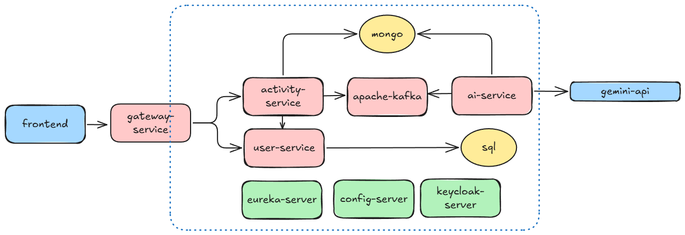

# Fitness App Architecture

Project Overview
--------------------------------------------------------------

This project is a fitness platform built using a microservices approach.
It allows users to track activities like workouts and runs.
User accounts and profiles are managed separately from activity data.
Activities are analyzed by an AI service to provide smart recommendations.
The system connects to an external AI API for advanced insights.
A central gateway makes access simple for the frontend.
The goal is to keep the app scalable, reliable, and easy to use.

App Components
--------------------------------------------------------------

fitness-frontend — Single Page React App with static assets.

gateway-service — API gateway code (routing, token validation).

user-service — user management, SQL persistence.

activity-service — activity ingestion, Mongo persistence, Kafka producer.

ai-service — Kafka consumer, Gemini (Google AI) for recommendations, Mongo writes.

kafka — Event streaming backbone that passes activity events between services.

keycloak — Identity and access server that handles user login and tokens.

config-server — Central place that provides consistent configuration to all services.

--------------------------------------------------------------
